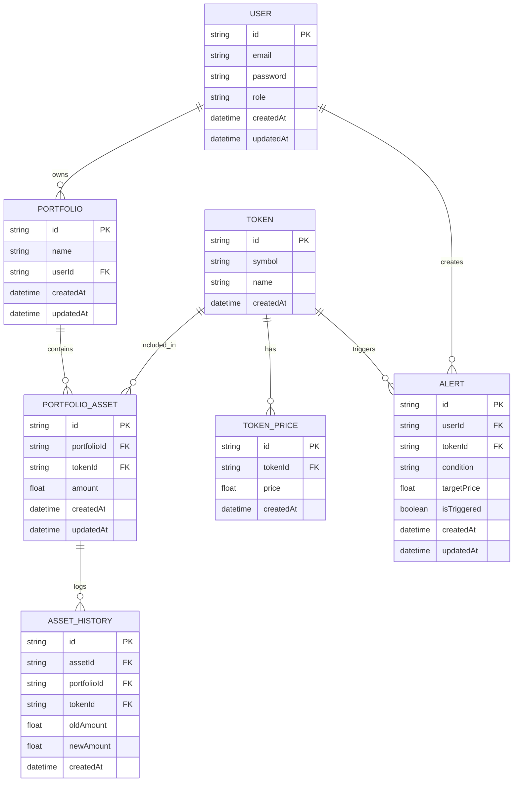

# @README – Backend Crypto Portfolio (NestJS)

🚀 Hệ thống Backend Quản lý Danh mục Đầu tư Crypto

(Thực tập 1 – Version 2)

📌 Giới thiệu dự án

Đây là dự án backend quản lý danh mục đầu tư tiền điện tử (crypto portfolio) được xây dựng với mục tiêu rèn luyện tư duy thiết kế hệ thống backend gần với thực tế sản phẩm, thay vì chỉ dừng lại ở CRUD cơ bản.

Dự án cho phép người dùng quản lý portfolio, theo dõi giá token, tạo cảnh báo giá tự động và cung cấp dashboard cho admin để giám sát toàn bộ hệ thống.
Trong quá trình phát triển, dự án được nâng cấp từ phiên bản cơ bản (v1) lên phiên bản định hướng production (v2) với background job, transaction, cache, logging và deploy bằng Docker.

🎯 Mục tiêu dự án

• Hiểu và áp dụng quy trình xây dựng backend thực tế

• Thiết kế database đúng chuẩn từ ERD

• Xây dựng authentication & authorization an toàn

• Xử lý nghiệp vụ phức tạp (portfolio, asset, alert)

• Làm quen với background job, cache, deploy

✨ Tính năng chính
👤 Chức năng cho User

• Đăng ký / đăng nhập bằng JWT

• Tạo và quản lý danh mục đầu tư (Portfolio)

• Thêm token vào portfolio với số lượng cụ thể

• Theo dõi giá token (mock → tự động cập nhật)

• Tạo cảnh báo giá (Alert) theo điều kiện:

    • Giá lớn hơn (GT)

    • Giá nhỏ hơn (LT)

🛡️ Chức năng cho Admin

• Phân quyền ADMIN riêng biệt

• Dashboard thống kê hệ thống:

• Tổng số user

• Tổng số portfolio

• Tổng số asset

• Tổng số alert

🧠 Tổng quan thiết kế hệ thống

• Token: dữ liệu nền (BTC, ETH, …)

• TokenPrice: bảng lưu lịch sử giá (time-series)

• PortfolioAsset: bảng trung gian lưu số lượng token trong portfolio

• Alert: hệ thống cảnh báo giá theo rule

• PriceCache: cache nghiệp vụ lưu giá mới nhất

• cache-manager / Redis: cache hạ tầng tối ưu hiệu năng API

👉 Giá trị portfolio được tính động, không lưu cứng trong DB:

• amount × latest token price

🛠️ Công nghệ sử dụng
Backend

• NestJS

• TypeScript

Database & ORM

• MySQL

• Prisma ORM

Authentication & Security

• JWT (JSON Web Token)

• bcrypt

Phân quyền theo vai trò (USER / ADMIN)

• Background & Performance

• Cron Job (@nestjs/schedule)

• Transaction đảm bảo tính nhất quán dữ liệu

• Cache (in-memory & Redis)

• Pagination & tối ưu query

Quản lý biến môi trường theo môi trường chạy

🏗️ Cấu trúc thư mục (rút gọn)

src/
├── modules/
│   ├── common/        # guard, decorator, cache, cron, logging
│   ├── user/          # auth, portfolio, asset, token, price, alert
│   ├── admin/         # admin dashboard
│   └── prisma/        # prisma service
├── main.ts
└── app.module.ts

🔐 Cơ chế Authentication & Authorization

1. User đăng nhập → nhận JWT

2. JWT được gửi qua header:

3. Authorization: Bearer <token>

4. Backend xác thực token bằng AuthGuard

5. RolesGuard kiểm soát quyền USER / ADMIN

6. Backend không tin dữ liệu từ client, mọi thông tin định danh đều lấy từ JWT.

⏱️ Background Job & Alert Engine

• Cron job tự động cập nhật giá token

• Giá mới nhất được lưu vào cache nghiệp vụ

• Hệ thống tự động kiểm tra và trigger alert

• Alert hoạt động không cần request từ user
## 11. ERD (mermaid)

