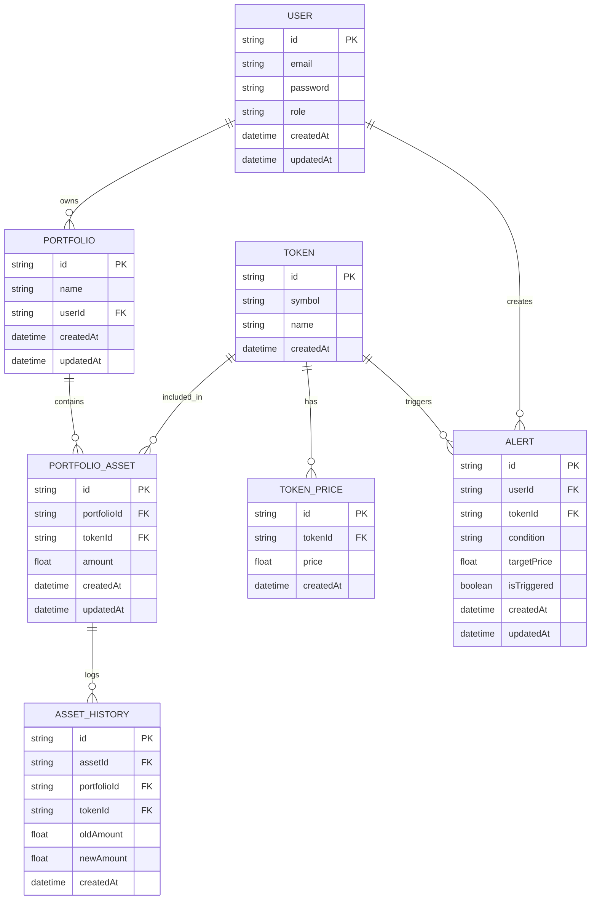

# @README – Backend Crypto Portfolio (NestJS)

Dự án backend quản lý danh mục đầu tư crypto (NestJS + Prisma + MySQL) với RBAC USER/ADMIN, cron cập nhật giá token realtime, cảnh báo giá và cache.
---
1. Elevator pitch
-   REST API chuẩn hóa response/error, tài liệu Swagger.
-   RBAC toàn cục (JWT + RolesGuard) tách PUBLIC/USER/ADMIN.
-   Dữ liệu giá token đồng bộ từ CoinMarketCap, lưu lịch sử, cache tốc độ cao.
-   Cảnh báo giá tự động bằng cron, ghi nhận trạng thái triggered.
-   Truy vết giao dịch tài sản qua AssetHistory và transaction Prisma.
---
2. Tech & kiến trúc
-   NestJS 11, TypeScript, Swagger.
-   Prisma ORM + MySQL (`DATABASE_URL`), seed/migrate scripts.
-   JWT Auth (`JWT_SECRET`, `JWT_EXPIRES_IN`), ValidationPipe whitelist/forbid, HttpExceptionFilter, TransformInterceptor.
-   Cache: cache-manager (admin stats) + in-memory PriceCache (giá mới nhất).
-   Cron: @nestjs/schedule để đồng bộ giá và kích hoạt alert.
---
3. Cấu trúc chính (backend)
-   `src/main.ts`: bootstrap, CORS, pipes, filters, interceptors, Swagger `/api`, port `process.env.PORT || 4333`.
-   `src/app.module.ts`: App composition, global AuthGuard + RolesGuard, global CacheModule.
-   `modules/user/*`: Auth, portfolios, assets, tokens, price, alerts.
-   `modules/admin/*`: Users CRUD (admin), dashboard stats (cache).
-   `modules/common/*`: decorators, guards, cache, axios (CMC), cron.
-   `src/prisma/schema.prisma`: User, Portfolio, Token, TokenPrice, Alert, PortfolioAsset, AssetHistory, enums Role/AlertCondition.
---
4. Luồng nghiệp vụ tiêu biểu
-   Đăng ký/Đăng nhập (`/auth/register`, `/auth/login`) -> JWT payload `{id,email,role}`.
-   USER:
    1. Tạo portfolio (`POST /portfolios`).
    2. Thêm/mua/bán tài sản (`POST /asset`, `DELETE /asset`) với kiểm tra quyền sở hữu, lưu AssetHistory.
    3. Xem giá: `GET /price` (cache nhanh), `GET /price/:id` (DB mới nhất).
    4. Tạo alert (`POST /alerts`), cron so sánh giá và set `isTriggered=true` khi đạt điều kiện GT/LT.
-   ADMIN:
    -   CRUD user (`/users`), xem danh mục bất kỳ (`/portfolios/admin/:id`), xem thống kê `/dashboard/stats` (cache 50s).
---
5. Đồng bộ giá & cache
-   Cron `*/80 * * * * *`: gọi CoinMarketCap (header `X-CMC_PRO_API_KEY`), bổ sung token mới, lưu `TokenPrice`, đẩy giá vào `PriceCache`.
-   Cron `EVERY_SECOND`: quét alert chưa trigger, lấy giá mới nhất từng token, đánh dấu triggered khi thỏa điều kiện.
-   Admin stats cache key `admin:stats` (users/portfolios/alerts/assets), TTL 50s.
---
6. API quick map
-   Public: `POST /auth/register`, `POST /auth/login`, `GET /price`, `POST /tokens/create` (seed token).
-   User (JWT): `/portfolios`, `/asset`, `/alerts`, `/price/:id`, `/tokens`.
-   Admin (JWT + role ADMIN): `/users`, `/dashboard/stats`.
---
7. Chuẩn response/error
-   Success: TransformInterceptor -> `{ success, messageKey, message, data, timestamp }`.
-   Error: HttpExceptionFilter map HTTP status -> messageKey, trả `{ success:false, messageKey, message, errors?, timestamp }`.
-   Message templates trong `share/messages.ts` giúp thống nhất localization key.
---
8. CSDL tóm tắt (Prisma)
-   User (role: USER/ADMIN) 1-n Portfolio, 1-n Alert.
-   Portfolio 1-n PortfolioAsset; AssetHistory lưu old/new amount.
-   Token 1-n TokenPrice (lịch sử giá), 1-n Alert.
-   Alert: condition GT/LT, targetPrice, isTriggered.
---
9. Chạy nhanh (dev)
```bash
cd be
npm install
npm run db:generate && npm run db:migrate   # Prisma client + migrate
npm run start:dev
# Swagger: http://localhost:4333/api
```

Biến môi trường tối thiểu: `DATABASE_URL`, `JWT_SECRET`, `JWT_EXPIRES_IN`, `CMC_API_KEY`, optional `PORT`.
---
10. Điểm nhấn kỹ thuật
-   RBAC toàn cục bằng APP_GUARD (AuthGuard + RolesGuard).
-   Cron + external API + cache kết hợp để giảm tải DB và tăng tốc đọc giá.
-   Transaction khi cập nhật tài sản để đồng bộ AssetHistory.
-   Response/error contract thống nhất giúp frontend tiêu thụ dễ dàng.
---
## 11. ERD (mermaid)


