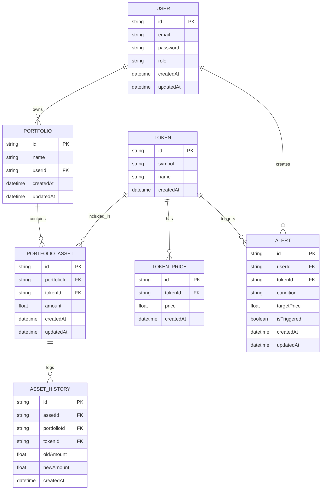

# 🚀 Thực tập 1 – Backend Crypto Portfolio (NestJS)

Backend mô phỏng hệ thống quản lý danh mục đầu tư crypto: RBAC USER/ADMIN, cập nhật giá token từ CoinMarketCap, cảnh báo giá tự động, cache và thống kê admin.

## 1. Kiến trúc & công nghệ

- NestJS 11, TypeScript, REST + Swagger.
- Prisma ORM + MySQL (`DATABASE_URL`).
- JWT Auth (`JWT_SECRET`, `JWT_EXPIRES_IN`), ValidationPipe whitelist/forbid, HttpExceptionFilter, TransformInterceptor.
- Cache: cache-manager cho thống kê admin, PriceCache in-memory cho giá mới nhất.
- Cron jobs (@nestjs/schedule) đồng bộ giá & kích hoạt cảnh báo.

## 2. Tính năng chính

- Đăng ký/Đăng nhập, phát JWT (payload `{id,email,role}`).
- RBAC toàn cục: AuthGuard (JWT) + RolesGuard (role USER/ADMIN), `@Public()` cho endpoint mở.
- Quản lý danh mục: tạo/list/sửa/xóa portfolio cho user; admin xem danh mục bất kỳ.
- Tài sản trong portfolio: mua/bán (cập nhật amount), lưu lịch sử `AssetHistory`.
- Token & giá:
  - Seed danh sách token từ CoinMarketCap.
  - Lưu lịch sử giá `TokenPrice`, trả giá mới nhất (cache hoặc DB).
- Cảnh báo giá: tạo/update/delete alert GT/LT, cron tự đánh dấu triggered khi đạt ngưỡng.
- Admin dashboard: thống kê users/portfolios/alerts/assets với cache 50s.

## 3. Cấu trúc mã nguồn (be/)

- `src/main.ts` – bootstrap, CORS, pipes, filters, interceptors, Swagger `/api`, port `process.env.PORT || 4333`.
- `src/app.module.ts` – ghép module, APP_GUARD (AuthGuard + RolesGuard), global cache.
- `modules/user`:
  - `auth`: register/login.
  - `portfolios`, `asset`, `tokens`, `price`, `alerts`.
- `modules/admin`:
  - `users`: CRUD user (admin).
  - `dashboard`: thống kê (dùng cache).
- `modules/common`: decorators, guards, cache wrapper, axios (CMC), cron jobs.
- `prisma/schema.prisma`: User, Portfolio, Token, TokenPrice, Alert, PortfolioAsset, AssetHistory; enums Role, AlertCondition.

## 4. Luồng nghiệp vụ

- User: đăng ký/đăng nhập → tạo portfolio → thêm token vào portfolio (mua/bán, log lịch sử) → xem giá → tạo alert; cron tự kích hoạt alert.
- Admin: đăng nhập → CRUD user → xem danh mục bất kỳ → xem dashboard stats (cached).
- Dòng giá: cron 80s lấy giá CMC, đồng bộ token mới, lưu `TokenPrice`, đẩy `PriceCache`; cron mỗi giây quét alert chưa trigger, so sánh giá mới nhất và cập nhật `isTriggered`.

## 5. API map nhanh

- Public: `POST /auth/register`, `POST /auth/login`, `GET /price`, `POST /tokens/create` (seed token).
- User (JWT): `/portfolios`, `/asset`, `/alerts`, `/price/:id`, `/tokens`.
- Admin (JWT + role ADMIN): `/users`, `/dashboard/stats`.

## 6. Chuẩn response & error

- Success: TransformInterceptor → `{ success, messageKey, message, data, timestamp }`.
- Error: HttpExceptionFilter map status → messageKey → `{ success:false, messageKey, message, errors?, timestamp }`.
- Message template tập trung tại `share/messages.ts` (dễ i18n/maintain).

## 7. Cơ sở dữ liệu (Prisma tóm tắt)

- User (role USER/ADMIN) 1-n Portfolio, 1-n Alert.
- Portfolio 1-n PortfolioAsset; AssetHistory log old/new amount.
- Token 1-n TokenPrice (lịch sử giá), 1-n Alert.
- Alert: condition GT/LT, targetPrice, isTriggered.

## 8. Biến môi trường tối thiểu

- `DATABASE_URL` – MySQL connection string.
- `JWT_SECRET`, `JWT_EXPIRES_IN` – ký/hạn JWT.
- `CMC_API_KEY` – CoinMarketCap API key.
- `PORT` (tuỳ chọn, mặc định 4333).

## 9. Chạy nhanh (dev)

```bash
cd be
npm install
npm run db:generate && npm run db:migrate   # tạo Prisma client + migrate
npm run start:dev
# Swagger: http://localhost:4333/api
```

## 10. Script hữu ích

- `npm run db:migrate`, `db:deploy`, `db:reset`, `db:seed`
- `npm run lint`, `npm run build`, `npm run start:prod`

## 11. ERD (mermaid)


