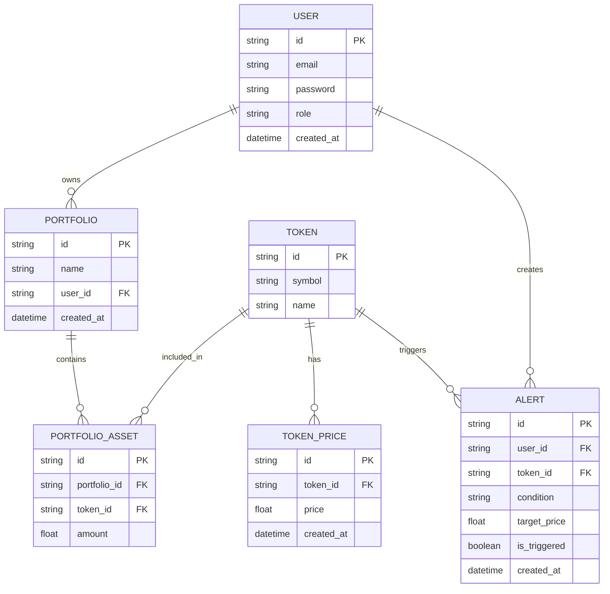

# 🚀 Thực tập 1 – Backend Internship Project

> A backend project focusing on system design, data modeling, and role-based access control.

---

## 📌 Overview

**Thực tập 1** là một dự án backend được xây dựng nhằm mô phỏng  
**hệ thống quản lý danh mục đầu tư crypto cá nhân**,  
tập trung vào **thiết kế hệ thống backend và tư duy dữ liệu**,  
không tập trung vào giao diện người dùng.

Dự án được thiết kế theo hướng:

- Đúng chuẩn backend thực tế
- Dễ mở rộng trong tương lai
- Phù hợp cho thực tập / junior backend developer

---

## 🎯 Project Objectives

- Thiết kế cơ sở dữ liệu theo mô hình ERD rõ ràng
- Hiểu luồng dữ liệu trong hệ thống backend
- Áp dụng phân quyền **USER / ADMIN**
- Phân tách rõ vai trò giữa backend và frontend
- Làm nền tảng cho các hệ thống phức tạp hơn

---

## 👥 Roles & Permissions

### 👤 User

- Register / Login
- Create and manage personal portfolios
- Add or remove tokens from portfolios
- Track token prices
- Create and manage price alerts

### 🛠️ Admin

- System monitoring and supervision
- View all users in the system
- View all portfolios and alerts
- Access system statistics via admin dashboard
- **No permission to modify market data**

---

## 🔐 Authorization Model

| Action                 | User | Admin |
| ---------------------- | ---- | ----- |
| Manage own portfolio   | ✅   | ❌    |
| View token prices      | ✅   | ✅    |
| Create alerts          | ✅   | ❌    |
| View all users         | ❌   | ✅    |
| View all portfolios    | ❌   | ✅    |
| Access dashboard stats | ❌   | ✅    |

---

## 🗂️ Data Model (ERD)

The system is designed around the following core entities:

- **User** – System accounts
- **Portfolio** – User investment portfolios
- **Token** – Shared list of crypto assets
- **PortfolioAsset** – Tokens inside portfolios (junction table)
- **TokenPrice** – Historical token price data
- **Alert** – User-defined price alerts

### Design Principles

- Single responsibility per table
- No redundant data storage
- Historical price tracking instead of single current price
- Clear one-to-many and many-to-many relationships

---

## 🔄 Core System Flows

### User Flow

Register
→ Create Portfolio
→ Add Token to Portfolio
→ Track Token Price
→ Create Price Alert

### Admin Flow

Login
→ View Users
→ Monitor Portfolios
→ Monitor Alerts
→ View System Dashboard

---

## 💹 Token Price Strategy

- Token and price data are treated as **background data**
- Backend acts as the **single source of truth**
- Frontend consumes data via backend APIs only
- System design supports **near real-time price updates**

> Real-time data handling is a backend responsibility, not a frontend concern.

---

## 📊 Admin Dashboard (API-Based)

The admin dashboard provides aggregated system statistics, such as:

- Total number of users
- Total number of portfolios
- Total number of alerts
- Active alerts count

> Dashboard refers to backend APIs, not UI components.

---

## 🛠️ Tech Stack

- **Node.js**
- **TypeScript**
- **NestJS**
- **Prisma ORM**
- **MySQL**
- **REST API**

---

## 🚧 Project Scope & Limitations

### Included

- Backend system design
- Role-based access control
- Relational data modeling
- Clear separation of concerns

### Not Included

- Frontend UI
- High-scale architecture
- Advanced real-time streaming
- On-chain data integration

---

## 🔮 Future Enhancements

- Authentication & authorization refinement
- Background jobs and alert engine
- Price update scheduling and caching
- Performance optimization
- Advanced system monitoring

---

## ✅ Conclusion

**Thực tập 1** is not intended to be a production-ready system.  
Its primary goal is to demonstrate **correct backend thinking from the start**:

- Clean data modeling
- Proper role separation
- Scalable system foundations

This project serves as a solid base for more advanced backend systems in the future.

==========================================================================================================================================================

